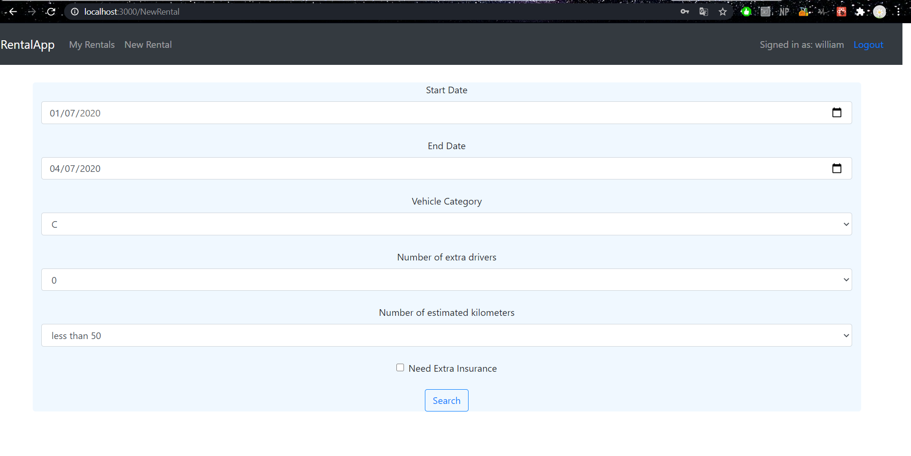

# Exam #1: "Car Rental"
## Student: s276062 DI CANIO DANIELA

## React client application routes

- Route `/`: Redirect to `/Catalogue` 
- Route `/Catalogue` : initial page accessible also by non-logged users. Contains a navbar and two type of filters (category and/or brands). When filters are set also results are dynamically updated.
Route `/Login` : Login form composed by email and password inputs.
Route `/MyRentals`: page with two tables filled with user's past and future rentals. Future rentals can be deleted only if start date > today
Route `/NewRental`: page where the user can select rental parameters, get a price proposal and possibly accept and proceed to payment.

## REST API server

- POST `/api/login`
  - request body content: {email,password}
- POST `/api/logout`
- GET `/api/vehicles`
  - request query parameters: filtersByCategory,filtersByBrands
  - response body content:vehicles (vector of objects)
- GET `/api/brands`
  - response body content: brands (vector of strings)
- GET `/api/user/profile`
  - response body content: user (object)
- GET `/api/user/rentals`
  - request query parameters: which ('past' or 'future')
  - response body content: rentals (vector of objects)
- GET `/api/getReport`
  - request query parameters: startDate, endDate, category, nExtraDrivers, estimatedKilometers, extraInsurance
- POST `/api/setReport`
  - request body content: vehicleID, startDate, endDate, category, nExtraDrivers, estimatedKilometers, extraInsurance, price
- POST `/api/pay`
  - stub API
-DELETE '/api/user/rentals/:rentalID'
  - request parameters: id of the rental to delete

## Server database

- Table `users` - contains (userID, email, name, hash, age)
- Table `vehicles` - contains (vehicleID, category, brand, model)
- Table `rentals` - contains (rentalID, userID, vehicleID, startDate, endDate, vehicleCategory, nExtraDrivers, estimatedKilometers, extraInsurance, price)

## Main React Components

- `RentalApp` (in `App.js`): root of the application tree. Route all pages.
- `NavBar` (in `App.js`): NavBar to allow navigation between pages. It is present in each page of the application but renders differently.
- `CataloguePage` (in `App.js`): Show vehicles according to filters by category and brand
- `LoginPage` (in `App.js`): Allow user access with email and password.
- `MyRentalsPage` (in `App.js`): Shows past and current rentals booked by user. Deleting rentals is only permitted when a rental is not current.
- `NewRentalPage` (in `App.js`): Allow to search and see rental proposal. User can insert payment data.

## Screenshot

## Test users

* kate@mail.it, password
* rose@mail.it, password (age more than 65)
* william@mail.it, password (frequent customer)
* alice@mail.it, password (age less than 25)
* harry@mail.it, password (frequent customer)
* john@mail.it, password
* anne@mail.it, password
* charlie@mail.it, password 
* aurora@mail.it, password (age less than 25)
* mike@mail.it, password 
